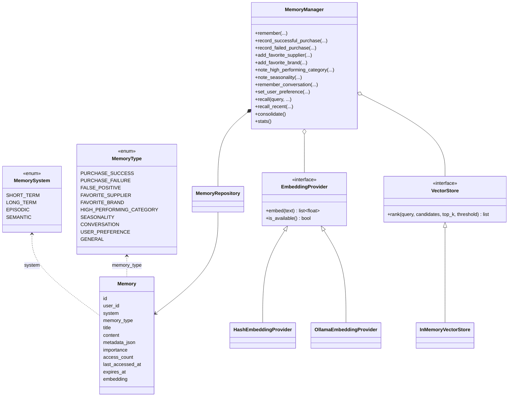
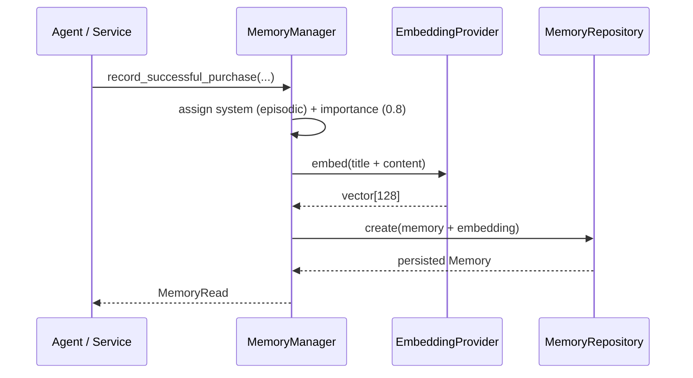
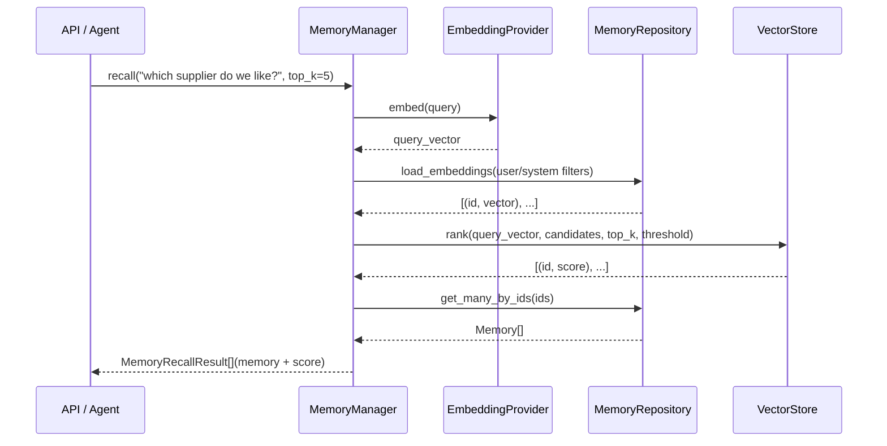
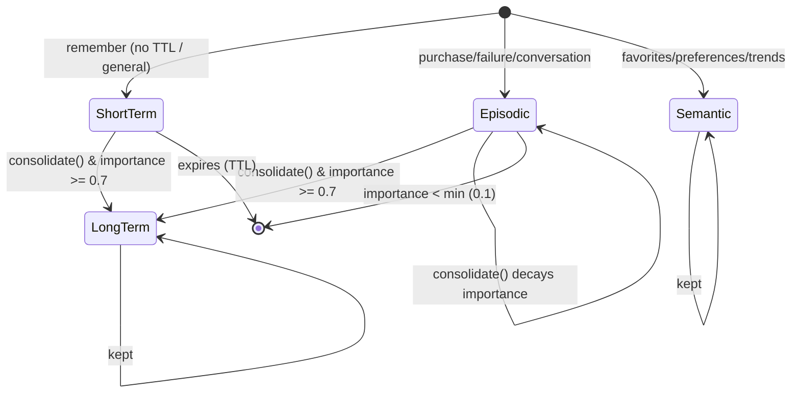
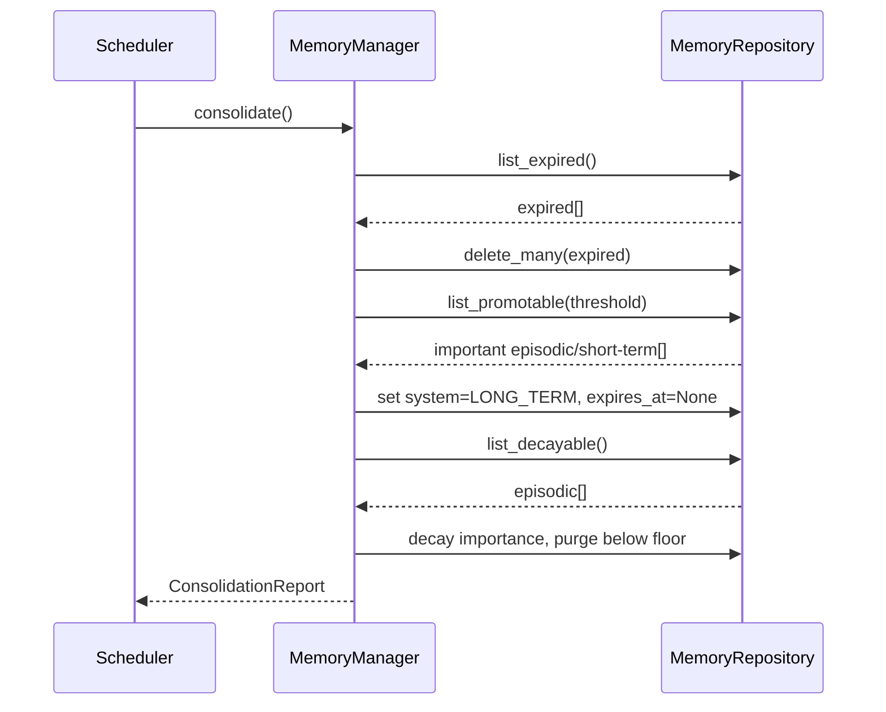

# AI Memory System

A persistent, queryable memory so the platform's AI (sourcing agent, assistant)
can **learn over time** — successful/failed purchases, false positives, favorite
suppliers and brands, high-performing categories, seasonality, past conversations
and user preferences — and recall that knowledge to make better decisions.

Memories live in their **own `memories` table**, completely separate from product
data, and are searchable via embeddings with a pluggable vector store.

---

## The four memory systems

Like human memory, the system separates *what just happened*, *durable facts*,
*specific events* and *generalized knowledge*:

| System | Role | Lifecycle |
|---|---|---|
| **Short-term** | Volatile working memory (recent context) | TTL-bounded; expires & is deleted |
| **Long-term** | Durable facts (promoted from below) | Kept indefinitely |
| **Episodic** | Specific events/experiences | Importance decays over time; important ones are promoted |
| **Semantic** | Generalized knowledge (favorites, trends, preferences) | Kept; highest retention |

### Knowledge types → system mapping

| MemoryType | Meaning | Default system |
|---|---|---|
| `purchase.success` | A purchase that worked | Episodic |
| `purchase.failure` | A purchase that failed | Episodic |
| `false.positive` | An opportunity that wasn't real | Episodic |
| `conversation` | A past user conversation | Episodic |
| `favorite.supplier` | A preferred supplier | Semantic |
| `favorite.brand` | A preferred brand | Semantic |
| `high_performing.category` | A category that performs well | Semantic |
| `seasonality` | Seasonal demand patterns | Semantic |
| `user.preference` | A user preference | Semantic |
| `general` | Anything else | Short-term |

---

## Architecture

```
app/memory/
├── models.py      Memory ORM + MemorySystem/MemoryType enums + system mapping
├── schemas.py     MemoryCreate, MemoryRead, MemoryRecallResult, MemoryStats, ConsolidationReport
├── config.py      MemoryConfig
├── errors.py      MemoryError hierarchy
├── embedding.py   EmbeddingProvider (Hash local, Ollama) — turns text into vectors
├── vector.py      VectorStore (InMemory) — ranks vectors by cosine similarity
├── repository.py  MemoryRepository — persistence (memories table)
├── manager.py     MemoryManager — the single facade (store/recall/lifecycle)
└── __init__.py    public exports
```

- **`MemoryManager`** is the ONLY entry point the rest of the platform uses. It
  coordinates the repository, the embedding provider, the vector store, and the
  lifecycle.
- **Memories are decoupled from product data**: rows carry no FK to products /
  orders / suppliers — those entities appear only as opaque strings inside
  `metadata_json`.
- **`EmbeddingProvider`** is pluggable. `HashEmbeddingProvider` (default) is
  deterministic and needs no external service; `OllamaEmbeddingProvider` gives
  real semantic embeddings via a local Ollama.
- **`VectorStore`** is the seam for future vector databases (pgvector, Qdrant,
  ...). Today `InMemoryVectorStore` ranks with brute-force cosine similarity.

### Class diagram



---

## Sequence diagram — storing a memory



The same path stores favorite suppliers, brand preferences, conversations, etc.
— each convenience method encodes the right type/system/importance.

---

## Sequence diagram — semantic recall (embedding search)



If embedding search is unavailable (provider down or `embedding_enabled=false`),
the manager falls back to **keyword search** (`ILIKE` on title/content) so recall
never breaks.

---

## Memory lifecycle



`consolidate()` runs one lifecycle pass:

1. **Expire** — delete short-term memories past their `expires_at`.
2. **Promote** — episodic/short-term memories with importance ≥ threshold are
   promoted to long-term (durable, `expires_at` cleared).
3. **Decay** — episodic-memory importance is decayed each pass; those below the
   floor are purged.

This keeps short-term memory small and fresh, preserves what matters, and
quietly forgets what no longer does. Run it on a schedule (or on demand via
`POST /api/v1/memory/consolidate`).

### Sequence diagram — consolidation



---

## Agent integration

When the sourcing agent runs, `SourcingPipeline.run_full_pipeline` now feeds its
decisions back into memory so the agent learns over time:

| Agent action | Memories recorded |
|---|---|
| `BUY` | `record_successful_purchase` + `add_favorite_supplier` + `note_high_performing_category` |
| `AVOID` | `record_false_positive` (so a repeated product/supplier is not re-pursued) |
| `ERROR` / no product | nothing (no signal) |

Memory writes are **best-effort** — a memory failure is caught and logged, and
never breaks the sourcing pipeline. The `MemoryManager` is injected into the
pipeline via `get_agent_deps` (using the shared embedding/vector singletons).

---

## Retrieval APIs

| Endpoint | Description |
|---|---|
| `GET /api/v1/memory/` | List memories (filter by `user_id`, `system`, `memory_type`) |
| `POST /api/v1/memory/` | Store a memory (`MemoryCreate`) |
| `GET /api/v1/memory/recall?q=...` | Semantic recall (embedding search, keyword fallback) |
| `GET /api/v1/memory/recent` | Recent short-term memories |
| `GET /api/v1/memory/types/{memory_type}` | Memories of one type (favorites, preferences, ...) |
| `GET /api/v1/memory/stats` | Aggregate statistics |
| `POST /api/v1/memory/consolidate` | Run a lifecycle pass |
| `GET /api/v1/memory/{id}` | Fetch one memory |
| `DELETE /api/v1/memory/{id}` | Delete one memory |

Domain convenience (used by the agent/assistant):
`record_successful_purchase`, `record_failed_purchase`, `record_false_positive`,
`add_favorite_supplier`, `add_favorite_brand`, `note_high_performing_category`,
`note_seasonality`, `remember_conversation`, `set_user_preference`.

---

## Embedding search & future vector databases

- **Embeddings are stored** as JSON in the `memories.embedding` column, so the
  schema needs no vector extension and works on any Postgres.
- **`EmbeddingProvider`** abstracts embedding generation: `local` (deterministic
  hashing — always works, great for tests and offline) or `ollama` (real
  semantics via a local model).
- **`VectorStore`** is the seam for a dedicated vector database. Swap
  `InMemoryVectorStore` for a `PgVector`/`Qdrant` implementation at scale without
  changing any domain code — just change DI + move the embedding column to a
  vector column.

```yaml
memory:
  embedding_provider: local   # or "ollama"
  embedding_enabled: true
  embedding_dim: 128
  ollama_url: http://localhost:11434
  ollama_model: nomic-embed-text
```

## Production considerations

- **Separation**: memories never reference products/orders/suppliers by FK — the
  bounded context stays independently purgable and portable.
- **Importance drives retention**: give consequential memories (favorite
  suppliers, preferences) high importance; let routine events decay.
- **Idempotency**: guard convenience calls by `external_id`/`user_id` so a
  retried agent step doesn't duplicate favorites/preferences.
- **User scoping**: `user_id = None` means platform-global memory, recallable by
  everyone; a specific `user_id` scopes to that user plus global knowledge.
- **Scheduler**: call `consolidate()` on a timer (analytics/agent scheduler) so
  short-term memory doesn't grow unbounded.
- **Cost**: use `local` embeddings (free) in development; enable `ollama` for
  real semantic recall; a hosted embedding API can be added behind the same
  `EmbeddingProvider` interface.

## Tests

`tests/test_memory.py` — 25 tests covering the enums/mapping, the repository,
storing + convenience methods, vector recall, keyword fallback, recall-recent,
get/delete, the full lifecycle (expire, promote, decay/purge), stats, and the
Agent wiring is covered in `tests/test_agent.py::TestDecisionMemory` (4 tests:
BUY → success/favorites, AVOID → false positive, no-manager no-op, memory
failure isolation).
