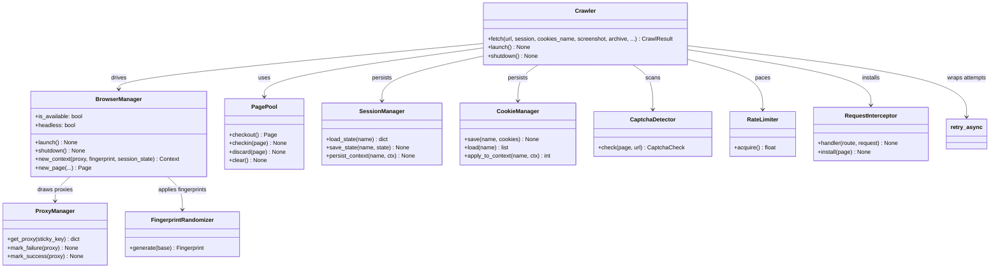
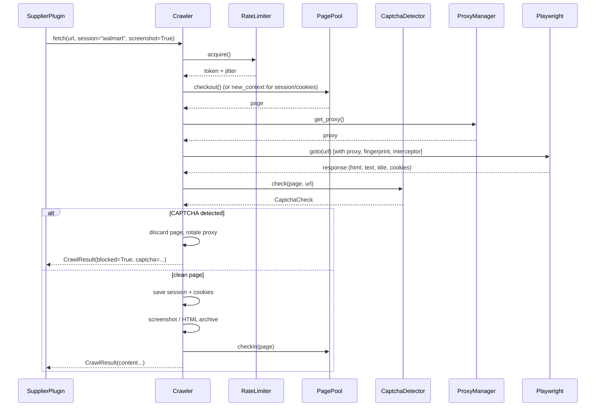

# Browser Automation Framework

A modular, production-ready Playwright wrapper for the Amazon sourcing platform.
Supplier plugins and scrapers use this framework **instead of implementing
browser automation individually** — they call the shared `Crawler`, which
handles the hard, repeatable problems: rate limiting, retries, CAPTCHA
detection, proxy rotation, sessions, cookies, screenshots, HTML archiving, and
fingerprint randomization.

```
app/browser/
├── manager.py         # BrowserManager      — owns the Playwright browser lifecycle
├── pool.py            # PagePool            — reusable pool of pages/contexts
├── session.py         # SessionManager      — persistent named browser sessions
├── cookies.py         # CookieManager       — persistent cookie jars
├── proxy.py           # ProxyManager        — proxy pool (rotation + ban tracking)
├── captcha.py         # CaptchaDetector     — CAPTCHA / anti-bot detection
├── interceptors.py    # RequestInterceptor  — resource blocking + header injection
├── rate_limiter.py    # RateLimiter         — token-bucket politeness limiter
├── retry.py           # retry_async         — exponential backoff retries
├── fingerprint.py     # FingerprintRandomizer — randomized UA/viewport/locale/TZ
├── storage.py         # screenshot + HTML archive persistence
├── crawler.py         # Crawler             — high-level service composing all above
├── config.py          # Pydantic config models
├── errors.py          # error hierarchy
└── models.py          # normalized result models
```

**Design rule:** Playwright is an optional dependency, loaded **lazily**. The
framework imports cleanly even when Playwright is not installed; a clear error
is raised only when a browser is actually needed. Add it with
`pip install '.[browser]' && playwright install chromium`.

---

## 1. Service overview

### `BrowserManager`
The single owner of the underlying browser. Lazily starts/stops Playwright,
supports **headless** and **visible** modes, and creates isolated contexts with
viewport / UA / locale / timezone / DPR. Applies fingerprint randomization and
per-context proxies.

```python
from app.browser import BrowserManager
mgr = BrowserManager(config)   # config: BrowserConfig
await mgr.launch()
page = await mgr.new_page(proxy=mgr.proxy_manager.get_proxy())
await mgr.shutdown()
```

### `PagePool`
Bounded pool of reusable `(context, page)` pairs. Creating a context is
expensive (fresh profile); pooling eliminates that per-request cost for
high-frequency crawling. `checkout()` / `checkin()` semantics; idle pages are
recycled; waiting at capacity respects a timeout.

### `SessionManager`
Persists named browser **sessions** (full storage state — cookies, localStorage,
origins) to disk so logged-in/customized states survive restarts and stay
isolated per supplier/task.

### `CookieManager`
Persists named **cookie jars** to a single JSON store (atomic writes) and
applies them to contexts.

### `ProxyManager`
Proxy pool with **round-robin / random / sticky** rotation, per-proxy failure
counting, and automatic **banning** after a threshold — so a bad proxy never
takes down a whole crawl.

### `CaptchaDetector`
Scans a page for CAPTCHA signals (selectors, iframes, URL fragments, titles,
body text, status codes) and returns a `CaptchaCheck` with provider and
confidence. Handles reCAPTCHA, hCaptcha, Cloudflare, Arkose, and generic walls.

### `RequestInterceptor`
`page.route` handler that **blocks heavy resource types** (image/media/font) to
speed scraping, blocks known ad/tracker domains, and **injects headers** on
remaining requests.

### `RateLimiter`
Token-bucket limiter with jitter for polite, human-looking request pacing.

### `retry_async`
Async retry helper with exponential backoff and configurable retryable-set.

### `FingerprintRandomizer`
Generates internally-consistent UA / viewport / locale / timezone / DPR combos
so each context looks like a distinct visitor.

### `Crawler` (the entry point)
Composes **everything**. A single `fetch(url)` call gets rate limiting, retries,
proxy rotation, CAPTCHA detection, session/cookie persistence, optional
screenshot + HTML archive, and request interception — returning a normalized
`CrawlResult`.

---

## 2. Class diagram



---

## 3. Component / package diagram

```mermaid
flowchart LR
    subgraph Plugins
        SP[SupplierPlugin\n(e.g. scrape.py)]
    end
    subgraph Framework[app/browser]
        C[Crawler]
        BM[BrowserManager]
        PP[PagePool]
        SM[SessionManager]
        CM[CookieManager]
        PM[ProxyManager]
        CD[CaptchaDetector]
        RL[RateLimiter]
        RI[RequestInterceptor]
        FR[FingerprintRandomizer]
    end
    subgraph External
        PW[Playwright / Chromium]
    end

    SP -->|"get_crawler()"| C
    C --> BM
    C --> PP
    C --> SM
    C --> CM
    C --> PM
    C --> CD
    C --> RL
    C --> RI
    BM --> PW
    BM --> PM
    BM --> FR
```

---

## 4. Sequence: a supplier `fetch`



Transient failures (`BrowserTimeoutError`, `ProxyError`, `BrowserRateLimitError`)
are retried with exponential backoff by `retry_async`.

---

## 5. How supplier plugins use it

Extend `BaseSupplierPlugin` and call `get_crawler()` (injected by the plugin
manager via DI). No supplier ever hand-rolls Playwright.

```python
from app.plugins.base import BaseSupplierPlugin

class RetailerPlugin(BaseSupplierPlugin):
    supplier_code = "retailer"

    async def lookup(self, sku: str):
        crawler = self.get_crawler()  # shared BrowserManager-backed Crawler
        result = await crawler.fetch(
            f"https://retailer.com/p/{sku}",
            session=self.supplier_code,      # persistent session
            screenshot=True,                 # captures screenshot
            archive=True,                    # saves raw HTML
        )
        if result.blocked:
            return None                      # CAPTCHA — handled gracefully
        # ... parse result.html / result.text → SupplierProductLookup
```

- Wiring: pass a shared crawler into `PluginManager(crawler=...)`; the DI entry
  point is `app/core/dependencies.get_crawler()`.
- A demonstrative config-driven browser supplier (`app/plugins/suppliers/scrape.py`)
  ships as a reference implementation.

---

## 6. Configuration

Driven by the `browser:` block in `config/*.yaml` → `BrowserAutomationConfig`
(see `app/browser/config.py`). Highlights:

| Key | Default | Meaning |
|-----|---------|---------|
| `enabled` | `false` | Master switch; `false` ⇒ no browser ever launched |
| `browser.headless` / `visible` | `true` / `false` | Headless vs visible window |
| `browser.max_pages` | `8` | PagePool capacity |
| `browser.max_retries` | `3` | Retries per `fetch` |
| `browser.request_delay_*_ms` | `500–2000` | Politeness jitter |
| `browser.block_resource_types` | `[image, media, font]` | Resources blocked |
| `browser.captcha_detection_enabled` | `true` | CAPTCHA scanning |
| `browser.fingerprint.*` | – | Fingerprint randomization toggles |
| `browser.proxy.proxies` | `[]` | Proxy pool entries |
| `browser.session_dir` / `cookie_file` | `browser_data/...` | Persistence paths |

The DI layer builds the shared `BrowserManager`/`Crawler` from this block, so an
unconfigured deployment never spawns a browser.

---

## 7. Error handling

All errors inherit `BrowserAutomationError`. Key subclasses:
`BrowserNotAvailableError`, `BrowserLaunchError`, `BrowserPoolTimeoutError`,
`BrowserPoolExhaustedError`, `CaptchaDetectedError`, `BrowserRateLimitError`,
`BrowserTimeoutError`, `ProxyError`, `ProxyExhaustedError`,
`SessionPersistError`, `CookieStoreError`.

CAPTCHA and hard errors never crash a crawl — `fetch` returns a
`CrawlResult(blocked=True, error=...)` (or raises when `raise_on_captcha=True`),
and the offending page is discarded so the pool stays clean.

---

## 8. Testing

`tests/test_browser.py` (43 tests) exercises the framework **without** a real
browser using fakes, covering: config validation, rate limiter, retries,
fingerprint, CAPTCHA detection, request interception, cookie/session
persistence, proxy rotation/banning, the page pool, the crawler (session,
cookies, CAPTCHA, blocked results), and the error hierarchy. Full suite:
**309 passed**.

---

## 9. Production notes

- **Install:** `pip install '.[browser]'` then `playwright install chromium`.
  Headless servers may need system deps: `playwright install --with-deps chromium`.
- **Keep `enabled: false`** until you add real proxies + a real browser target;
  otherwise a headless browser is launched on every app start.
- **Respect robots / ToS** of any site you crawl; use `RateLimiter` and your own
  data. The framework provides the *tooling*, not permission.
- Proxy health: pair `ProxyManager.mark_failure` with the crawler's automatic
  retry to auto-rotate off dead proxies.
- Scale: `BrowserManager` can be swapped to connect to a Playwright server
  (`connect_over_cdp`) for distributed crawling without code changes.
