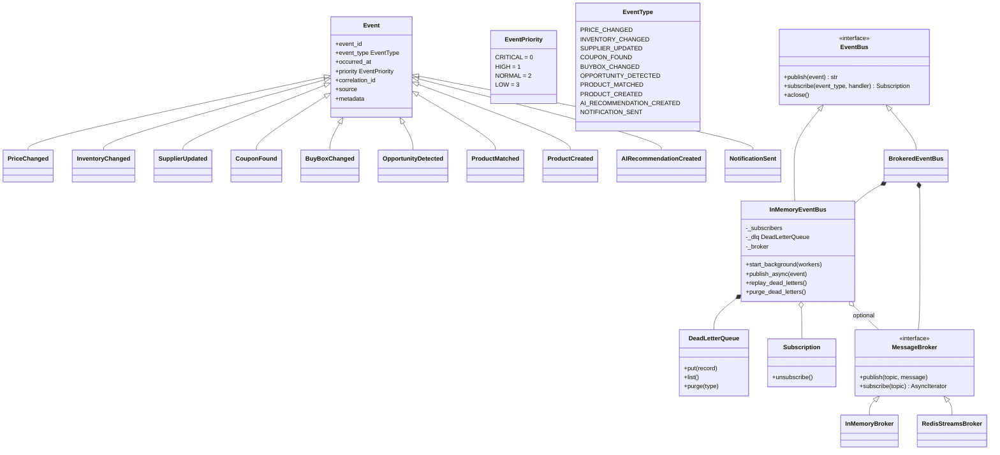
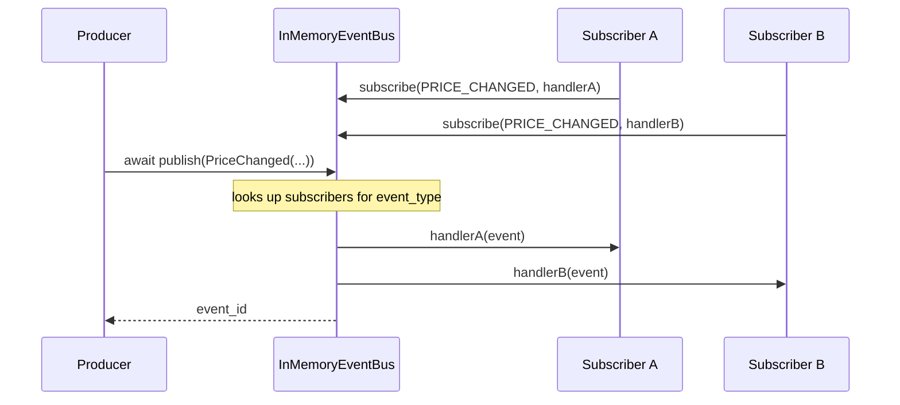
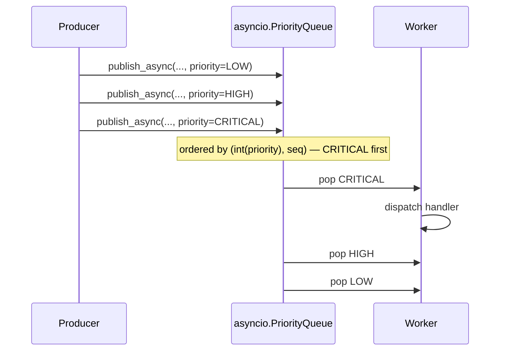
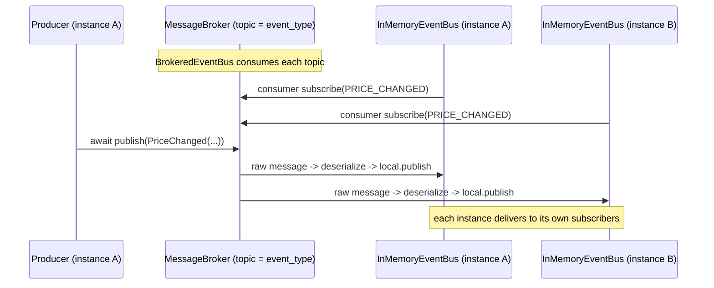

# Internal Event Bus

An **event-driven architecture** for the platform. Modules communicate by
publishing and subscribing to domain *events* instead of calling each other
directly. This decouples producers from consumers: a module raises an event and
any number of subscribers react — without the producer knowing who (if anyone)
listens.

The bus is fully **internal / in-process today** (correct for the current
single-process monolith) and ships with a **transport seam** (`MessageBroker`)
so the same publish/subscribe API can fan out across a distributed fleet later
— no changes to domain code.

---

## Why events?

| Concern | Before (direct coupling) | After (events) |
|---|---|---|
| A price change should trigger analytics, re-pricing, notifications | Pricing module must know & call all three | Publish `PriceChanged`; each subscriber reacts independently |
| Adding a new consumer | Edit the producer | Add one `subscribe()` call |
| A consumer is down | Producer must handle it | Retry + dead letter queue isolate the failure |
| Urgent vs. routine work | Same call path | `EventPriority` ordering |
| Scaling out | Rewrite the wiring | Swap to a distributed `MessageBroker` |

---

## Components

```
app/events/
├── models.py    Event, EventType (10), EventPriority, payloads, registry, (de)serialize
├── bus.py       EventBus (ABC), InMemoryEventBus (retry/DLQ/priority), BrokeredEventBus
├── broker.py    MessageBroker (ABC), InMemoryBroker, RedisStreamsBroker
├── dlq.py       DeadLetterQueue, DeadLetterRecord
├── config.py    EventBusConfig
├── errors.py    EventBusError hierarchy
└── __init__.py  public exports
```

- **`Event`** — Pydantic envelope (id, type, occurred_at, priority, correlation_id, source, metadata) + typed payload fields. `extra="forbid"` enforces a tight schema.
- **`EventType`** — the routing key (10 domain events). Topics in a distributed broker equal `EventType.value`.
- **`EventPriority`** — `IntEnum`; **lower value = higher priority** (matches `asyncio.PriorityQueue`).
- **`InMemoryEventBus`** — the default bus. `publish`/`subscribe`, per-subscription retry with exponential backoff + jitter, a bounded dead letter queue, and priority ordering via background workers.
- **`MessageBroker`** — the distributed transport contract. `InMemoryBroker` is the default; `RedisStreamsBroker` is ready for horizontal scaling.
- **`DeadLetterQueue`** — retains failed deliveries (bounded) for inspection/replay/purge.

---

## Class diagram



---

## Sequence diagram — publish → subscribe (happy path)



Handlers may be sync or async. Delivery is `await`-ed inline, so ordering is
deterministic and tests are reliable. **Handlers should be fast**; slow work
should go through the background queue (`publish_async`).

---

## Sequence diagram — retry, dead letter, replay

```mermaid
sequenceDiagram
    participant P as Producer
    participant Bus as InMemoryEventBus
    participant H as Subscriber (flaky)
    participant DLQ as DeadLetterQueue

    P->>Bus: await publish(ProductCreated(...))
    Bus->>H: attempt #1
    H-->>Bus: raises RuntimeError
    Bus->>Bus: sleep(backoff)
    Bus->>H: attempt #2
    H-->>Bus: raises RuntimeError
    Bus->>H: attempt #3
    H-->>Bus: raises RuntimeError (max_retries=2 reached)
    Bus->>DLQ: put(DeadLetterRecord)
    Note over DLQ: event retained, ready for replay
    Bus-->>P: event_id (publish returns; delivery isolated)

    P->>Bus: await replay_dead_letters()
    Bus->>DLQ: read records
    Bus->>H: republish (attempt may now succeed)
    H-->>Bus: ok
```

- An unhandled exception → retried with `backoff_base * 2^(n-1)` + jitter.
- After `max_retries` → the event is **dead-lettered** with the handler + error.
- Raising `EventHandlerError` in a handler skips retry and dead-letters immediately (terminal failure).
- `replay_dead_letters()` / `purge_dead_letters()` manage the queue.

---

## Sequence diagram — priority ordering (background workers)



`start_background(num_workers)` spawns workers that drain the priority queue.
This is the path for slow handlers so the publisher never blocks.

---

## Sequence diagram — distributed broker seam (future)



The `MessageBroker` protocol lets the platform move from single-process
(`InMemoryBroker`) to horizontal (`RedisStreamsBroker`) without changing how
domain code publishes/subscribes. `BrokeredEventBus` bridges the two.

---

## The 10 domain events

| EventType | Payload fields | Typical publishers | Typical subscribers |
|---|---|---|---|
| `price.changed` | external_id, marketplace, old/new price, currency | marketplace ingestion, re-pricing | pricing analytics, notifications |
| `inventory.changed` | external_id, marketplace, old/new qty, warehouse | inventory sync | order service, restock alerts |
| `supplier.updated` | supplier_code, name, status, change | supplier plugins / admin | sourcing, notifications |
| `coupon.found` | supplier_code, sku, coupon_code, discount, expires_at | coupon crawler | profit engine, notifications |
| `buybox.changed` | external_id, marketplace, winner, price | marketplace buybox watcher | re-pricing, alerts |
| `opportunity.detected` | external_id, marketplace, score, reason, est. profit | sourcing engine | agent decision, notifications |
| `product.matched` | supplier_sku, external_id, match_score, matched_by | matching engine | sourcing, catalog |
| `product.created` | product_id, asin, title | product service | catalog, analytics, agent |
| `ai.recommendation.created` | recommendation_id, kind, summary | agent / assistant | notifications, analytics |
| `notification.sent` | notification_id, channel, recipient, subject | notifier | analytics, audit log |

---

## Usage

```python
from app.core.dependencies import get_event_bus
from app.events import EventType, PriceChanged

bus = get_event_bus()          # shared in-process singleton

# Consume
def on_price_change(event: PriceChanged) -> None:
    ...

sub = bus.subscribe(
    EventType.PRICE_CHANGED,
    on_price_change,
    max_retries=3,
    priority_filter={EventPriority.HIGH, EventPriority.CRITICAL},
)
...
sub.unsubscribe()

# Produce
await bus.publish(PriceChanged(external_id="B0X", new_price=25.5))

# Fire-and-forget for slow handlers (after start_background)
await bus.start_background(num_workers=2)
await bus.publish_async(NotificationSent(notification_id="n1", channel="email", recipient="a@b.c"))

# Dead letter queue
bus.dead_letters.list()
await bus.replay_dead_letters()
await bus.purge_dead_letters(EventType.NOTIFICATION_SENT)
```

## Adding a new event

1. Add a value to `EventType`.
2. Create a subclass of `Event` — it auto-registers via `event_registry()`; nothing else to wire.
3. Subscribe/publish as usual.

## Wiring & config

- DI entry point: `app/core/dependencies.get_event_bus()` (a shared `InMemoryEventBus`).
- Config: `event_bus:` block in `config/<env>.yaml` (`default_max_retries`, `backoff_*`, `jitter`, `dlq_capacity`, `broker_type`).

```yaml
event_bus:
  enabled: true
  default_max_retries: 3
  backoff_base_ms: 200
  backoff_max_ms: 5000
  jitter: true
  dlq_capacity: 1000
  broker_type: memory   # or "redis" for horizontal scaling
```

## Production considerations

- **Fast handlers**: inline delivery awaits handlers; keep them cheap or use the background queue.
- **Retry policy per subscriber**: a flaky analytics consumer shouldn't force a critical notifier to wait. Configure `max_retries`/`backoff` per subscription.
- **Backpressure**: the in-memory bus is single-process. For high throughput or multiple instances, enable the `RedisStreamsBroker` — the API is unchanged.
- **Idempotency**: at-least-once delivery means handlers should be idempotent (guard by `event_id`/`correlation_id`).
- **DLQ hygiene**: monitor `dead_letters`; replay or purge so a poisoning event can't accumulate.
- **Correlation**: propagate `correlation_id` from inbound requests through emitted events to trace a business flow end to end.

## Tests

`tests/test_events.py` — 36 tests covering registry, (de)serialization, publish/subscribe, unsubscribe, retry, dead letter (bounded, replay, purge, terminal error), priority ordering in background workers, priority filters, lifecycle errors, the distributed broker seam, and the DI singleton.
