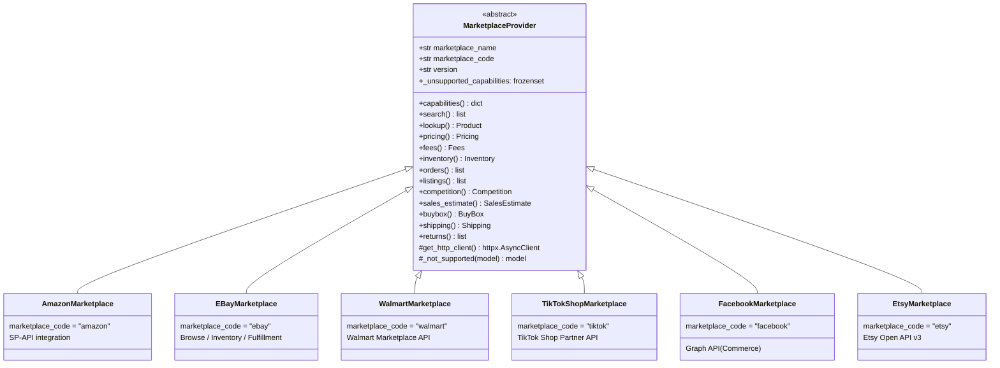
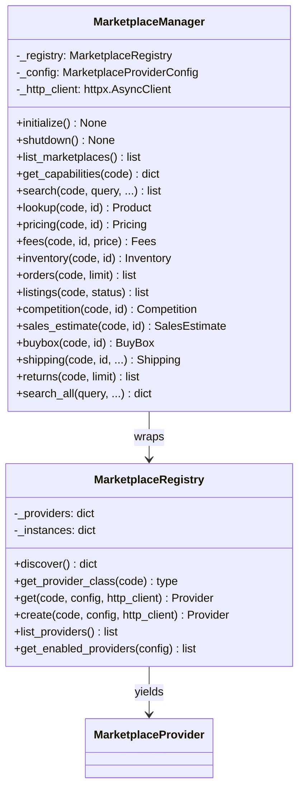
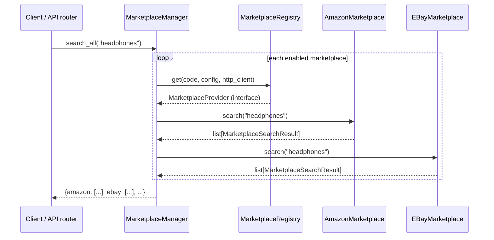
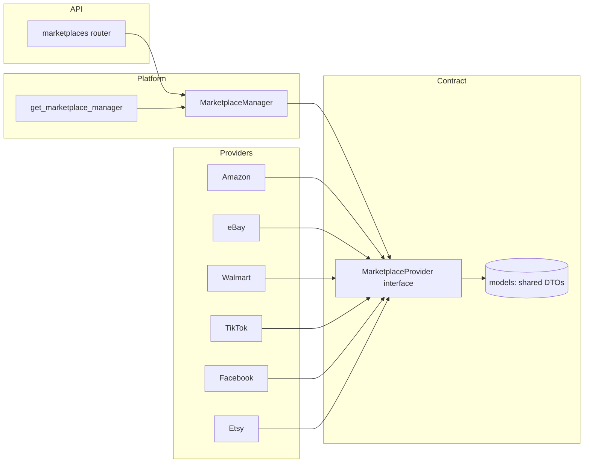

# Marketplace Abstraction Layer

A pluggable layer that lets the platform sell/source across **any** marketplace
(Amazon, eBay, Walmart Marketplace, TikTok Shop, Facebook Marketplace, Etsy, …)
through a single `MarketplaceProvider` interface.

**Core rule:** Amazon is **not** hardcoded anywhere in the platform. All
marketplace-specific logic lives inside the provider implementations. The rest
of the platform communicates **only** through `MarketplaceProvider` / the
`MarketplaceManager`.

```
app/
├── marketplaces/                 # ← the abstraction layer
│   ├── base.py                   # MarketplaceProvider (interface, 12 methods)
│   ├── models.py                 # Standardized DTOs (shared contracts)
│   ├── config.py                 # MarketplaceConfig / MarketplaceProviderConfig
│   ├── errors.py                 # MarketplaceError hierarchy
│   ├── registry.py               # MarketplaceRegistry (auto-discovery)
│   ├── manager.py                # MarketplaceManager (single entry point)
│   └── providers/                # ← concrete marketplaces
│       ├── amazon.py             #   Amazon (SP-API)
│       ├── ebay.py               #   eBay (Browse/Inventory/Fulfillment)
│       ├── walmart.py            #   Walmart Marketplace
│       ├── tiktok.py             #   TikTok Shop (Partner API)
│       ├── facebook.py           #   Facebook Marketplace (Graph API)
│       └── etsy.py               #   Etsy (Open API v3)
```

---

## 1. The Interface: `MarketplaceProvider`

Every marketplace implements the same 12 capabilities:

| # | Method | Returns |
|---|--------|---------|
| 1 | `search(query, page, page_size)` | `list[MarketplaceSearchResult]` |
| 2 | `lookup(external_id)` | `MarketplaceProduct \| None` |
| 3 | `pricing(external_id)` | `MarketplacePricing \| None` |
| 4 | `fees(external_id, price)` | `MarketplaceFees \| None` |
| 5 | `inventory(external_id)` | `MarketplaceInventory \| None` |
| 6 | `orders(limit)` | `list[MarketplaceOrder]` |
| 7 | `listings(status)` | `list[MarketplaceListing]` |
| 8 | `competition(external_id)` | `MarketplaceCompetition \| None` |
| 9 | `sales_estimate(external_id)` | `MarketplaceSalesEstimate \| None` |
| 10 | `buybox(external_id)` | `MarketplaceBuyBox \| None` |
| 11 | `shipping(external_id, quantity, postal_code)` | `MarketplaceShipping \| None` |
| 12 | `returns(limit)` | `list[MarketplaceReturn]` |

All 12 are **abstract** methods — the ABC enforces that every concrete provider
implements all 12 (verified by a contract test). Providers that cannot provide a
capability return a typed `supported=False` result instead of raising, so the
platform degrades gracefully.

### Class diagram



### Capability coverage

| Capability | Amazon | eBay | Walmart | TikTok | Facebook | Etsy |
|---|:---:|:---:|:---:|:---:|:---:|:---:|
| search | ✅ | ✅ | ✅ | ❌ | ❌ | ✅ |
| lookup | ✅ | ✅ | ✅ | ❌ | ❌ | ✅ |
| pricing | ✅ | ✅ | ✅ | ❌ | ❌ | ✅ |
| fees | ✅ | ❌ | ❌ | ❌ | ❌ | ✅ |
| inventory | ✅ | ✅ | ✅ | ✅ | ❌ | ❌ |
| orders | ✅ | ✅ | ✅ | ✅ | ✅* | ✅ |
| listings | ✅ | ✅ | ✅ | ✅ | ✅* | ✅ |
| competition | ✅ | ✅ | ❌ | ❌ | ❌ | ❌ |
| sales_estimate | ❌ | ❌ | ❌ | ❌ | ❌ | ❌ |
| buybox | ✅ | ✅* | ❌ | ❌ | ❌ | ❌ |
| shipping | ✅ | ✅ | ❌ | ❌ | ❌ | ❌ |
| returns | ✅ | ❌ | ✅ | ✅ | ❌ | ❌ |

`*` = best-effort. Facebook Marketplace has no public selling API, so its
commerce calls are best-effort Graph API calls; everything else degrades
gracefully. A provider's true coverage is reported at runtime via
`capabilities()`.

---

## 2. Registry & Manager



- **`MarketplaceRegistry`** auto-discovers providers by scanning
  `app.marketplaces.providers` for `MarketplaceProvider` subclasses. No manual
  registration.
- **`MarketplaceManager`** is the **only** entry point the rest of the platform
  uses. It injects config, shares one `httpx.AsyncClient`, and isolates failures
  (one marketplace failing never breaks another).
- `_get_provider` returns only the `MarketplaceProvider` interface type — the
  caller never touches a concrete class.

---

## 3. Sequence: searching across marketplaces



A single-marketplace call is identical but targets one code. Errors are caught
per-marketplace and logged, so `search_all` always returns the successes.

---

## 4. Adding a new marketplace (zero changes to existing code)

1. Create `app/marketplaces/providers/mymarket.py`.
2. Subclass `MarketplaceProvider`, set `marketplace_name`/`marketplace_code`/`version`.
3. Implement all **12** methods. For unsupported ones, return `self._not_supported(Model)` (single result) or `[]` (lists).
4. Add the unsupported capability names to `_unsupported_capabilities`.
5. (Optional) export it in `app/marketplaces/providers/__init__.py`.

That's it — the registry auto-discovers it, the manager exposes it, and the API
router serves it. No existing code is touched.

---

## 5. Wiring & the "only via provider" rule

- **DI:** `app/core/dependencies.py` provides `get_marketplace_manager()`, a
  lazily-initialized shared `MarketplaceManager`. Services depend on this.
- **API:** `app/api/v1/marketplaces.py` exposes all 12 capabilities as REST
  endpoints, talking only through the manager.
- **Boundary test** (`tests/test_marketplaces.py::TestBoundary`) enforces that
  `app/api/` and `app/domain/` never import `app.marketplaces.providers`.
- **Contract test** enforces every provider implements all 12 methods.



---

## 6. Production considerations

- **Auth:** credentials come from `MarketplaceConfig` (env/YAML), never committed.
  Providers raise `MarketplaceConfigurationError` if enabled but unconfigured.
- **Error isolation:** every manager call isolates per-provider failures and
  standardizes them into `MarketplaceError` subclasses → mapped to HTTP in
  `app/main.py`.
- **Rate limiting/retry:** `max_retries` / `request_timeout` are per-marketplace
  in config; upstream 429s raise `MarketplaceRateLimitError`.
- **Shared HTTP client:** one `httpx.AsyncClient` is pooled across providers for
  connection reuse; closed on shutdown.
- **Graceful degradation:** unsupported capabilities return `supported=False`
  instead of throwing — the platform can hide features via `capabilities()`.
- **Testing:** 17 dedicated tests (contract, discovery, capabilities, graceful
  degradation, isolation, boundary). Full suite: **266 passed**.

---

## 7. Future-proofing

When a new marketplace (or an expanded API for an existing one) appears:
- A marketplace only exposes what it can do (`capabilities()`).
- A third-party sales-estimate source (e.g. Keepa) can back Amazon/eBay/Etsy's
  `sales_estimate()` behind this same interface — the platform won't change.
- If the platform evolves toward microservices, this layer maps 1:1 to a
  **Marketplace service**; the shared DTOs in `models.py` are the cross-service
  contract.
